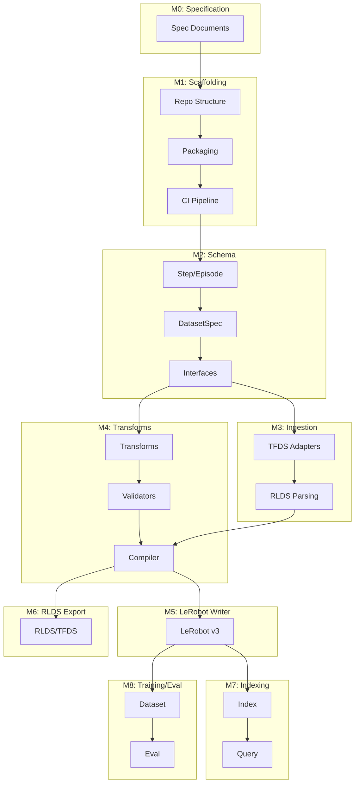

# Dependency Graph

## Critical Path

1. **M0 → M1**: Spec before scaffolding
2. **M1 → M2**: Package before schema
3. **M2 → M3**: Interfaces before adapters
4. **M2 → M4**: Interfaces before transforms
5. **M3 + M4 → M5/M6**: Ingestion + transforms before writers
6. **M5 → M7**: LeRobot writer before indexing
7. **M5 → M8**: Writer before training utilities

## Parallelizable

- M5 (LeRobot) and M6 (RLDS) can proceed in parallel
- M3 (Ingestion) and M4 (Transforms) after M2
- Sub-tasks within each milestone
